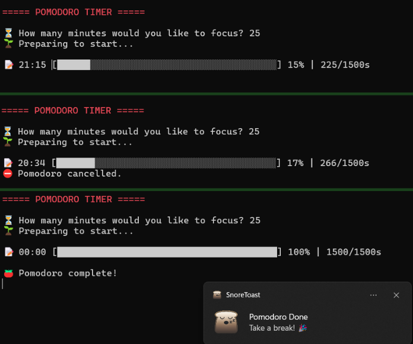

# 🍅 Pomodoro CLI
[](https://nodejs.org/)

A simple and colorful command-line Pomodoro timer built with Node.js to help you stay focused and productive.

## ✨ Features
- ⏱ Set your custom focus duration in minutes
- 📊 Real-time CLI progress bar
- 🔔 Desktop notification when the timer ends
- ❌ Cancel the productive session with `Ctrl+C`

## 🛠️ Installation and how to run
1. **Clone the repository:**
   ```bash
   git clone https://github.com/tarsi-bytes/pomodoro-cli-node.git
   cd pomodoro-cli-node
   ```
2. **Install dependencies:**
   ```bash
   npm install
   ```
3. **Start the timer with:** 
    ```bash 
    node main.js
    ```
4. **Then follow the prompt:**
    ```bash 
    ⏳ How many minutes would you like to focus?
    ```

## 📸 Preview

Here's what the Pomodoro CLI looks like in action:



## 📦 Dependencies
- chalk – terminal string styling
- cli-progress – progress bar for CLI
- node-notifier – desktop notifications
- readline – built-in Node.js module for command line interaction

## 🧠 What is the Pomodoro Technique?

The **Pomodoro Technique** is a popular time management method created by Francesco Cirillo in the late 1980s. It boosts productivity by breaking work into focused time blocks — usually **25 minutes of deep work** followed by a **5-minute break**. Each work-break cycle is called a "Pomodoro."

After completing four Pomodoros, you take a longer break (15–30 minutes) to recharge and avoid burnout.

### 🍅 Why "Pomodoro"?

“Pomodoro” is the Italian word for **tomato**. Cirillo named the technique after the **tomato-shaped kitchen timer** he used as a university student to track his study sessions. The name stuck — and so did the method!

---

👩‍💻 Created by [@tarsi-bytes](https://github.com/tarsi-bytes)